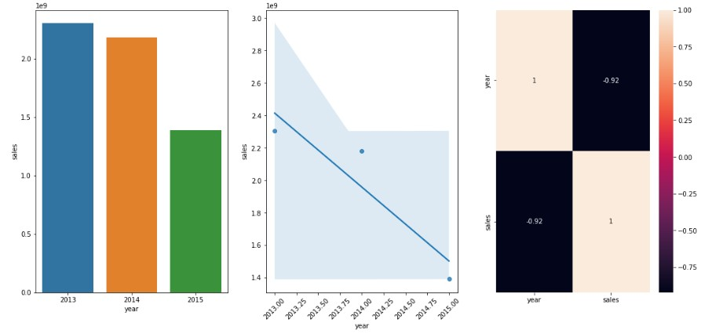

# Projeto de Previsão de Vendas: Drogarias Rossmann

O objetivo desse projeto é fornecer para o CFO e Gerentes das Lojas ,uma previsão de faturamento no final de 6 semanas, para que o CFO possa planejar e alocar valores para futuras reformas das lojas.

Para alcance dessa proposta será utilizada técnicas de exploração de dados, focando nas vendas das lojas contidas em uma base de dados fornecida pela Rossmann.

# 1. Drogarias ROSSMANN

### 1.1 Contexto do negócio:

A Rossmann é uma cadeia de formácias fundada em 1972 por Dirk Rossmann. É considerada uma das maiores redes de farmácias na Europa com cerca de 56.200 colaboradores e mais de 4000 lojas. Em 2019 Rossmann faturou mais de 10 bilhões, considerando países como: Alemanha, Polonia, Hungria, Republica Tcheca, Turkia, Albania, Kosovo e Espanha. Fonte: [Wikipedia](https://en.wikipedia.org/wiki/Rossmann_(company)

O objetivo do case é fornecer os valores de vendas das farmácias para que assim o CFO e Gerentes, possam alocar mais precisamente e corretamente os valores para realizações de eventuais melhorias e reformas das lojas. Desse maneira o CFO solicitou para equipe de DS da empresa, uma previsão das vendas das lojas no final de 6 semanas.

A principal estratégia para resolução da solicitação do CFO, será utilizadas técnicas de análises exploratórias com base em um arquivo disponibilizado pelo CFO das vendas das lojas dos anos de 2013, 2014 e 2015.

## 1.2 Questão do negócio:

Considerações:

a) O time do negócio não consegue fornecer essas informações ao CFO;

b) O portfólio é muito grande, o que tomaria muito tempo para fazer o trabalho manualmente.

Em resumo, o projeto visa responder às seguintes perguntas de negócio:

- Qual é o valor total de produtos vendidos para cada loja no final de 6 semanas ?

- Com base no projeto, qual é o melhor e pior cenário de vendas em valores ?

## 1.3 Sobre os dados:

Os dados foram extraídos do link abaixo, onde constam todas as vendas das farmácias do período de 2013 a 2015.

[https://www.kaggle.com/harlfoxem/housesalesprediction](https://www.kaggle.com/c/rossmann-store-sales)

Abaixo uma tabela com os atributos e descrição do conjunto de dados:

|***Atributo*** | ***Descrição*** |
| -------- | --------- |
|**store** | Identificação de cada loja |
|**day_of_week** | dia da semana |
|**date** | data da realização da venda |
|**sales** | quantidade de vendas de uma determinada data |
|**promo** | aponta se uma farmácia esta realizando promoção ou não |
|**state_holiday** | Indica feriados nacionasi. Geralmente todas as lojas entram em recesso em feriados nacionais, a seguinte legenda pode ser interpretada para essa coluna de informações: a = public holiday, b = easter holiday, c = christmas e 0 = None|
|**school_holiday** | indica se a loja foi afetada pelo fechamento de escolas públicas devido a algum feriado |
|**store_type** | Diferencia as lojas em 4 modelos diferentes: a, b, c e d |
|**assortment** | Indica o tipo de sortimentos que a loja possuí, a = basic, b = extra e c = extended |
|**competition_distance** | Distância em metros, da loja concorrente mais próxima |
|**competition_open_since_month** | Indica o mês que o competidor mais próximo foi aberto |
|**competition_open_since_year** | Indica o ano que o competidor mais próximo foi aberto |
|**promo2** | Indica se a loja efetuou em algum momento promoções consecutivas, 0 = store is no participating, 1 = store is participating  |
|**promo2_since_week** | Descreve a semana que a loja aderiu a promo2 |
|**promo2_since_year** | Descreve o ano que a loja aderiu a promo2 |
|**is_promo** | Descreve se a loja esta ou não em promoção, 0 = não esta em promoção, 1 = esta em promoção |
|**year** | Ano da venda |
|**month** | Mês da venda |
|**day** | Dia da venda |
|**week_of_year**| Semana do ano |
|**year_week**| Concatenação da semana do ano e o ano |
|**competition_since**| Concatenação das colunas: competition_open_since_month e competition_since_year  |
|**competition_time_month**| Quantidade de meses desde que a competição mais próxima começou |
|**promo_since**| Concatenação das colunas promo2_since_year e promo2_since_week |
|**promo_time_week**| Descreve a quantidade em semanas que uma promoção esta ocorrendo |

## 1.4 Premissas do negócio:

Dentro do processo de entendimento de negócio, exploração dos dados e decisão para fornecer os insights finais, foram adotadas as seguintes premissas:

- Os dados disponíveis são do período de 01/01/2013 a 31/07/2015;
- Lojas sem informação de distância do competidor mais próximo, foram consideradas com distância de 200.000 metros;

# 2. Planejamento para solução do problema:

1. Limpeza de dados
2. Feature Engineering
3. Filtragem de variáveis
4. Exploração de dados
5. Preparação dos dados
6. Seleção de variáveis
7. Aplicação de modelos de ML
8. Fine-Tuning Hyperparameter
9. Avaliação dos algoritmos

## 2.1  Insights e Hipóteses encontradas:

#### H8. Lojas deveriam vender mais ao longo dos anos.
- **FALSA** Apesar de não termos o ano de 2015 fechado, vemos uma tendência das lojas venderem menos ao longo dos anos

#### H9. Lojas deveriam vender mais no segundo semestre dos anos.
- **FALSA** Lojas vendem menos ao longo do segundo semestre dos anos

#### H10. Lojas deveriam vender mais depois do dia 10 de cada mês.
- **VERDADEIRA** Lojas vendem mais depois do dia 10 de cada mês

#### H11. Lojas deveriam vender menos aos finais de semana.
- **VERDADEIRA** Lojas vendem menos no finais de semana

#### H12. Lojas deveriam vender menos durante os feriados escolares.
- **VERDADEIRA** Lojas vendem menos durante os feriados escolares, exceto os meses de Julho e Agosto.

## 2.2  Modelos de Machine Learning Utilizados e métricas de performance:

Para esse projeto foram utilizados os seguintes algoritmos de Machine Learning:

- Linear Regression
- Linear Regression Regularized com Lasso
- Random Forest Regressor
- XGBoost Regressor

Na avaliação de performance, o XGBoost não desempenhou a melhor performance de todas, porém devido a questão de aprendizado, seguimos com ele, pois no entendimento para esse projeto tentei uma abordagem diferente, já que a utilização dos outros algoritmos possuí vasta aplicação e possuí amplo material de consulta, diferente do XGBoost.

# 3. Resultado da análise para o Negócio:

Apos todo o processo descrito no notebook, para preparação e treinamento do modelo desenvolvido, chegamos em uma predição de receita bruta no final de 6 semanas de $ 286.45 Milhões de dólares, também consideramos o pior e melhor cenários, ao qual utilizamos para o calculo o Mean Absolute Error (MAE), o melhor e pior cenários são $ 287.29 Milhões e $ 285.57 Milhões, respectivamente.

Apesar de chegarmos aos valores brutos, entendemos que uma consulta por loja seria mais interessenta para detalhamento das receitas. Utilizando dessa premissa, deixamos também como parte do projeto a opção do CFO analisar a previsão de cada loja serapardamente além de disponibilizar um acesso a um bot do telegram, a qual o mesmo, ou qualquer pessoa interessada, bastará possuir o app Telegram em seu telefone, o endereço do bot do Telegram e um acesso a internet. Uma imagem da previsão de cada loja, e o link do bot telefram encontram-se abaixo:
Bot Telegram: https://web.telegram.org/z/#5944327385 

Abaixo conseguimos ver o resultando em uma time line das previsões e uma comparação quanto ao baseline e um gráfico que exibe quanto o modelo esta super e subestimando as previsões: 
 
 

Funcionamento do Bot Telegram, o usuário deverá escrever o comando / + número da loja, para fins didáticos foram utilizados de exemplo as lojas 23, 24 e 35 conforme imagem abaixo: 

# 4. Conclusão e pontos de melhorias:

O projeto tem como princípio a geração de insights para o negócio, assim como responder algumas perguntas feitas pela empresa. O objetivo foi concluído, e foi possível extrair informações relevantes e com potencial forma de gerar direcionamento para as próximas operações da House Rocket.

As visualizações fornecidas irão permitir com que a empresa possa avaliar as regiões mais lucrativas, os atributos que levam o imóvel a se tornar mais viável para as operações de compra e venda, e ainda visualizar o lucro máximo que poderá ser alcançado de acordo com as opções de negócio.

Pontos de Melhorias:

Melhor a técnica de preenchimento de *Missing Values*: por exemplo, competition_distance, poderá ser utilizado métodos como preenchimento considerando a média da distância das lojas perto dessa loja da Rossmann, assim mediana ou moda caso faça sentido.

Coletar mais dados: por exemplo o ano de 2015 não esta completo como informado no tópico que trata das premissas do negócio.
